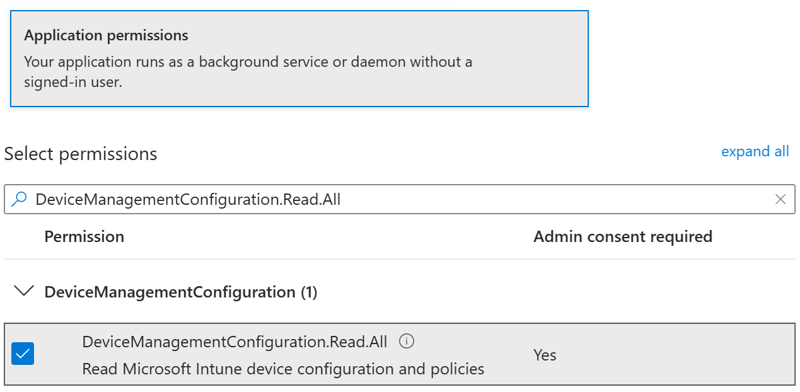

# Basetune

> Compare Intune policies across tenants — securely, offline-capable, and fully under your control


---

## What it does

Basetune is a PowerShell-based tool to compare **Intune Settings Catalog** and **Security Baseline** policies across tenants or exported baselines. Common use cases include compliance audits and baseline comparisons.

Policies can be loaded:
- **Online** via Microsoft Graph API
- **Offline** from exported JSON files

Comparison capabilities:
- **Source vs. Target** — Each comparison run compares one source against one target. Source and target can be any combination of online tenants and offline JSON folders.
- **Unlimited tenant configuration** — Configure as many tenants and baselines as you need, then pick which two to compare at runtime (from the UI or via CLI parameters).
---

## Why Basetune?

**Secure by design**
- Use your own App Registration
- No delegated authentication (no user context)
- No third-party multi-tenant apps
- No external data processing
- All access is read-only and fully controlled by your own tenant configuration
- **Client secrets are encrypted** with Windows DPAPI (CurrentUser scope) — never stored in plaintext

**Fully offline capable**
- Compare exported JSON policies without any tenant connection

**Flexible tenant configuration**
- Configure an unlimited number of tenants and baselines
- Mix online and offline sources freely — every comparison picks one source and one target from your configured set

**Performance focused**
- Minimal Graph API calls after initial load
- Local caching of policies, settings, and definitions
- Built-in error handling and retry logic

---

## How comparison works

1. Policies are loaded from both tenants (via Graph API or JSON files)
2. Each policy's `settings` array is flattened into individual `settingInstance` objects
3. Settings are matched by `settingDefinitionId` across source and target
4. Each pair is classified as **Match**, **Diff**, **Missing**, or **Extra**
5. If `settingDefinitions.json` and `settingCategories.json` are present in `.\Definitions`, IDs are resolved to friendly display names
6. Results are written to HTML and CSV

**Setting Definitions:**
Download setting definitions and categories once via the UI or `-Download` (CLI). Without this cache, reports will show raw setting definition IDs.

**Missing categories:**
If at least one side is online, missing categories are resolved automatically via Graph API and added to `settingCategories.json`.
If both sides are offline and a category cannot be resolved, it will appear as **`[Unresolved Category]`** in the report.

---

## Output

For every setting, the report identifies:

- **Match** — the setting is present in the target with the same value
- **Diff** — the setting is present but the value differs
- **Missing** — the setting is not present in the target at all
- **Extra** — the setting is present in the target but not in the source (`diff.csv` only)

On top of that, it detects cross-policy issues within the target tenant:

- **Duplicate** — the setting appears in multiple target policies with the same value
- **Conflict** — the setting appears in multiple target policies with different values

| File | Description |
|---|---|
| `diff.csv` | Full detail — one row per source setting × target policy match |
| `report.html` | Visual overview — one row per unique setting with aggregated status |
| `summary.csv` | Per baseline policy: Total / Match / Missing / Diff counts + Compliance % |
| `overlap.csv` | Only Duplicate and Conflict settings, with all involved target policies and values |

The HTML report (`report.html`) lets you drill down per setting — expand any row to see exactly which target policies contain that setting and what value each one has. The report header shows the source and target tenant names.


## Supported patterns / edge cases

Below are a number of non-trivial cases that the tool handles correctly. Each entry shows the source setting (as visible in the UI) and how the tool represents it in the report.

### Implicit parent levels in the breadcrumb path

The breadcrumb path in the `Setting` column may contain parent levels that are **not** defined as categories in the categories JSON file. The tool reconstructs the full hierarchy from the policy structure itself, inserting the parent policy name as an additional path segment for its sub-settings.

For example, `Choose how BitLocker-protected operating system drives can be recovered` is not a category in the JSON. Yet it appears as a parent segment in the path of its sub-setting.

This means the breadcrumb path reflects the **logical** hierarchy as shown in the UI, not just the category tree from the JSON. Sub-settings are always prefixed with their parent policy name so that the relationship remains clear in flat output formats (CSV, tables).

### Nested sub-settings under a single parent policy

Some policies contain multiple sub-settings (toggles, dropdowns) under one main setting. The tool splits these into separate rows using a breadcrumb path, and combines the parent value with the selected option into a single string.

**Source setting:**

- *Choose how BitLocker-protected operating system drives can be recovered* → `Enabled`
  - *Allow data recovery agent* → `False`
  - Dropdown → `Do not allow 256-bit recovery key`

**Report output:**

| Setting | Source value |
|---|---|
| Administrative Templates > Windows Components > BitLocker Drive Encryption > Operating System Drives > Choose how BitLocker-protected operating system drives can be recovered | Enabled: Do not allow 256-bit recovery key |
| Administrative Templates > Windows Components > BitLocker Drive Encryption > Operating System Drives > Choose how BitLocker-protected operating system drives can be recovered > Allow data recovery agent | Disabled |

### List values (variable length)

Policies that contain a list of values (such as file extensions, keywords, or paths) are serialized as a single string with `|` as the separator. The parent toggle and the list are shown as separate rows.

**Source setting:**

- *Exclude specific kinds of files from being uploaded* → `Enabled`
  - Keywords: `*.accdb`, `*.appx`, `*.bat`, `*.cmd`, `*.exe`, `*.img`, `*.iso`, `*.jar`, `*.lnk`, `*.mdb`, `*.msi`, `*.pst`, `*.reg`, `*.vbs`, `*.vhd`, `*.vhdx`, `*.vmdk`

**Report output:**

| Setting | Source value |
|---|---|
| OneDrive > Exclude specific kinds of files from being uploaded | Enabled |
| OneDrive > Exclude specific kinds of files from being uploaded > Keywords: (Device) | *.accdb \| *.appx \| *.bat \| *.cmd \| *.exe \| *.img \| *.iso \| *.jar \| *.lnk \| *.mdb \| *.msi \| *.pst \| *.reg \| *.vbs \| *.vhd \| *.vhdx \| *.vmdk |

---

## Requirements

- PowerShell 7+
- An **App Registration** in each tenant with the following Microsoft Graph API **application permissions**:
  - `DeviceManagementConfiguration.Read.All`
- Auth methods supported: `ClientSecret` or `Certificate` (both use the **OAuth 2.0 client credentials flow** — app-only, no user login required)

---


## Setup

**1. Download the latest release**

Go to the [Releases](https://github.com/roweski/basetune/releases/latest) page and download the latest `Basetune.zip`. Extract it to a folder of your choice.

**2. Configure your tenants**

Basetune uses a **multi-tenant config** — you define any number of named tenant entries and pick source and target at runtime, either from the UI or via CLI parameters. Each comparison run uses exactly one source and one target.

Tenants are configured through the UI (gear icon → Tenant Configuration) or by editing `Config\Config.json` directly.

Each tenant entry requires:

| Field | Description |
|---|---|
| `displayName` | Friendly name shown in dropdowns |
| `authMethod` | `ClientSecret`, `Certificate`, or `None` (offline JSON only) |
| `tenantId` | Entra tenant ID |
| `clientId` | App registration client ID |
| `clientSecret` | Client secret (when authMethod = ClientSecret). Stored encrypted with DPAPI — see [Secret storage](#secret-storage) |
| `certThumbprint` | Certificate thumbprint (when authMethod = Certificate) |
| `path` | Local folder for JSON files (when authMethod = None) |


Example `Config\Config.example.json`:

```json
{
  "tenant": {
    "1": {
      "displayName": "Contoso",
      "authMethod": "ClientSecret",
      "tenantId": "00000000-0000-0000-0000-000000000000",
      "clientId": "00000000-0000-0000-0000-000000000000",
      "clientSecret": "your-client-secret-here"
    },
    "2": {
      "displayName": "Fabrikam",
      "authMethod": "Certificate",
      "tenantId": "11111111-1111-1111-1111-111111111111",
      "clientId": "11111111-1111-1111-1111-111111111111",
      "certThumbprint": "YOUR_CERTIFICATE_THUMBPRINT"
    },
    "3": {
      "displayName": "OIB v3.8",
      "authMethod": "None",
      "path": "C:\\Export\\OpenIntuneBaseline-main\\WINDOWS\\IntuneManagement\\SettingsCatalog"
    }
  }
}
```

> Plaintext `clientSecret` values in `Config.json` (e.g. from the example above, or copied from an older install) are **automatically migrated to encrypted form on first load**. After migration, the on-disk value is replaced with a `DPAPI:`-prefixed blob — the original plaintext is gone. See [Secret storage](#secret-storage) for details.

> For `Certificate` auth, the certificate must be available in the Windows Certificate Store. Basetune looks in **`CurrentUser\My`** first and falls back to **`LocalMachine\My`**. To import a certificate, double-click the `.pfx` file and choose **Current User**, or use `certmgr.msc`. The certificate is used to sign a JWT assertion (RS256) as the client credential in the OAuth 2.0 token request.

**3. Download setting definitions (run once in online mode)**

Before running your first comparison, download the setting definitions and categories. Basetune uses these to resolve display names in the reports, otherwise the reports will use raw setting definition IDs. Both `settingDefinitions.json` and `settingCategories.json` are saved to `.\Definitions` and reused for all subsequent comparisons.

To pre-populate the definition and category cache, run the CLI with `-Download -Id <id>` using an online tenant. The Id represents the unique key in Config.json (use `.\BasetuneCLI.ps1 -Tenants` to list all tenants):

```powershell
# Explicit tenant (recommended)
.\BasetuneCLI.ps1 -Download -Id 1

# Without -Id: falls back to the first online tenant in Config.json
.\BasetuneCLI.ps1 -Download
```

Or use the UI. When no setting definitions are available, the Download icon in the status bar is highlighted in blue — click it to start.

<a href="docs/controls.png" target="_blank">
  
</a>

Select a tenant from the list, or create a new one in the tenant configuration using an app registration.

<a href="docs/definitions.png" target="_blank">
  
</a>

Once the download completes, the icon returns to its neutral state — definitions are cached and ready to use.

<a href="docs/controls2.png" target="_blank">
  
</a>

---

## UI

Basetune includes a WPF-based UI for configuring and running comparisons without using the command line.


### Running the UI

**Via CMD launcher**

```powershell
.\Start-BasetuneUI_PS7.cmd
```

**Via PowerShell 7**

```powershell
.\BasetuneUI.ps1
```

### Tenant Configuration

Manage all tenants via Tenant Configuration.

Tenant with App Registration:

<a href="docs/tenant.png" target="_blank">
  
</a>

**App Permissions**

To function correctly, the App Registration only requires a single Microsoft Graph permission: `DeviceManagementConfiguration.Read.All`

> ⚠️ **Important:** Please ensure that an administrator grants tenant-wide admin consent for this permission after adding it.

<a href="docs/permissions.png" target="_blank">
  
</a>

Tenant with exported JSON policies:

<a href="docs/json.png" target="_blank">
  
</a>


### Report folder and performance options

Configure the default report folder and set the number of parallel threads used for Graph API requests. Higher values will result in faster policy evaluation when expanding settings, but may increase the risk of API throttling

<a href="docs/options.png" target="_blank">
  
</a>

---

## CLI

Basetune includes a command-line interface for running comparisons and exports from a terminal or automation script.


### Running the CLI

**Via CMD launcher**

```powershell
.\Start-BasetuneCLI_PS7.cmd
```

**Via PowerShell 7**

```powershell
.\BasetuneCLI.ps1
```

---

## Authentication

Basetune uses a **stateless authentication model**.

### Stateless token handling

- Tokens are retrieved **on demand**
- Stored **in memory only**
- **Never written to disk**
- **Never persisted or reused**

### No external dependencies

Basetune does **not require**:
- Multi-tenant app registrations
- External services
- Shared authentication

---

## Secret storage

Client secrets for `ClientSecret` tenants are stored in `Config\Config.json` in **encrypted form** using the **Windows Data Protection API (DPAPI)**. Plaintext secrets never touch disk after the first save.

### How it works

- **Encryption scope:** `CurrentUser` — the secret can only be decrypted by the **same Windows user** on the **same machine** that encrypted it. Other users on the same box (including local admins) cannot decrypt it.
- **Storage format:** encrypted values in `Config.json` are prefixed with `DPAPI:` followed by a hex-encoded blob. Anything without that prefix is treated as plaintext.
- **Automatic migration:** if you place a plaintext secret in `Config.json` (e.g. from the example file, or from an older install), Basetune detects it on first load, encrypts it with DPAPI, and rewrites `Config.json` in place. The plaintext value is replaced — no manual step needed.
- **In memory:** decrypted secrets exist briefly in memory only for the duration of the OAuth 2.0 token request, then drop out of scope. Tokens themselves are never persisted (see [Authentication](#authentication)).

### What this means in practice

| Scenario | Behaviour |
|---|---|
| You configure a tenant via the UI | Secret is encrypted before it's written to disk |
| You paste a plaintext secret directly into `Config.json` | Encrypted automatically on next load |
| You copy `Config.json` to a colleague's machine | Their Basetune cannot decrypt the secrets — the UI will log a clear "re-enter the secret" message per tenant. The tenant entries still appear, only the credentials are missing. |
| You copy `Config.json` to a different Windows user account on the same machine | Same as above — DPAPI `CurrentUser` scope binds to the user profile, not the machine |
| You move to a new machine | Re-enter secrets once on the new machine; from then on they're encrypted under that user/machine combination |

### Why CurrentUser scope (and not LocalMachine)

`LocalMachine` scope would let any user on the same box (service accounts, admin RDP sessions, scheduled tasks running as SYSTEM) decrypt the secrets — effectively worse than keeping them in your own user profile. `CurrentUser` is the same scope used by the Microsoft Graph PowerShell SDK, AzureAD module, and `Connect-AzAccount` for cached token storage, and is the standard choice for Windows-local credential protection.

### Scheduled tasks and service accounts

Because DPAPI binds the encrypted secret to the **Windows user profile that encrypted it**, running the CLI under a different account — for example via Task Scheduler under a service account — requires a one-time setup step in that account's context.

**Setup steps for a service account (e.g. `svc-basetune`)**

1. Log in interactively as the service account (RDP, `runas /user:svc-basetune powershell`, or "Switch user"). The DPAPI master key is created when the user profile is first loaded.
2. Create or copy `Config.json` into the Basetune folder. Plaintext secrets are fine at this stage — they'll be migrated on first load.
3. Trigger one config load under that account to perform the plaintext → DPAPI migration. The cheapest way:
   ```powershell
   .\BasetuneCLI.ps1 -Tenants
   ```
   This reads `Config.json`, encrypts any plaintext `clientSecret` values under the service account's DPAPI key, and writes the encrypted form back to disk.
4. From this point on, scheduled tasks running as `svc-basetune` can decrypt the secrets and authenticate normally.

**Common pitfalls**

| Situation | Result |
|---|---|
| `Config.json` was created by your own user and then placed in the service account's folder | Scheduled task fails with `Cannot decrypt clientSecret`. Different DPAPI master key. Repeat steps 2–3 under the service account. |
| Task scheduled with "Run whether user is logged on or not" | Works fine. DPAPI only requires the profile to have been loaded *at least once*, not to be currently active. |
| Service account uses `gMSA` (group Managed Service Account) or `Virtual Account` | DPAPI is unreliable or unavailable for these account types — they often have no loadable profile. Use **Certificate authentication** instead (see below). |
| The machine is reimaged or the service account is recreated | DPAPI master key is gone. Re-enter all secrets via the UI, or restart from plaintext in `Config.json` and re-run step 3. |

**Recommendation for automation**

For unattended scenarios — especially on servers, with gMSA accounts, or anywhere the profile may not be reliably loaded — prefer **Certificate authentication**. A certificate in `LocalMachine\My` can be used by any account with read access to the private key, doesn't depend on DPAPI, and survives profile resets. The certificate thumbprint stored in `Config.json` is not a secret and doesn't need encryption.

### Certificate authentication

Certificate-based tenants don't store any secret in `Config.json` — only the certificate thumbprint. The private key lives in the Windows Certificate Store (`CurrentUser\My` or `LocalMachine\My`) and is used to sign a JWT assertion (RS256) on each token request. The same `CurrentUser` vs `LocalMachine` trade-off applies to where you import the certificate.

---

## Error Handling, Throttling & Retries

The module features a robust, built-in error handling mechanism within `Invoke-IntuneGraphRequest` to ensure resilience during bulk operations and high-concurrency workloads.

### Resilience Framework
When making Graph API requests, the module automatically categorizes and reacts to different response behaviors:

| Issue / HTTP Status | Scenario | Module Behavior & Action |
| :--- | :--- | :--- |
| **API Throttling**<br>`HTTP 429` / `503` | Graph rate limits exceeded. | Reads the `Retry-After` header (defaults to 10s if absent). Backs off and retries up to **5 times** before failing. |
| **Server Errors**<br>`HTTP 500` / `502` / `504` | Transient gateway or server faults. | Automatically retries up to **3 times** using **exponential back-off** (2s, 4s, 8s...). |
| **Intune Proxy Errors**<br>`HTTP 200` with Error Body | Graph returns success but payload contains an error object (e.g., `UnknownError`). | Treated as a transient API error; retries up to **3 times** with exponential back-off. |
| **Expired Token**<br>`HTTP 401` | Access token has expired mid-flight. | Automatically requests a fresh access token and retries the request exactly **once**. |
| **Fatal Errors**<br>All other codes | Bad requests, permissions issues, etc. | Immediately aborts the request and throws an actionable exception to prevent infinite loops. |

### Performance Optimization Tip
When configuring **Parallel Threads** for settings expansion or policy evaluations, keep this behavior in mind:
* **Higher thread counts** will speed up the process initially.
* However, excessive parallel requests increase the likelihood of triggering **HTTP 429 (Throttling)**.
* While the module gracefully handles this by pausing and retrying, heavy throttling will ultimately reduce overall performance and introduce execution delays. Find a balanced thread count that optimizes speed without constantly hitting rate limits.
---


## Offline JSON compatibility

Offline mode accepts Intune Settings Catalog and Security Baseline JSON files exported by any of the following tools:

| Source | How to export |
|---|---|
| **Basetune CLI** | Use `-Export <tenant id>` |
| **Basetune UI** | Click the export button. |
| **Intune portal** | Devices → Configuration → select policy → Export JSON |
| **[Open Intune Baseline](https://github.com/SkipToTheEndpoint/OpenIntuneBaseline)** | Download JSON files from GitHub |
| **[Micke-K IntuneManagement](https://github.com/Micke-K/IntuneManagement)** | Export Settings Catalog policies via the built-in export |

> Any JSON that contains `id`, `name`, and a `settings` array will work with Basetune.

---

## License

MIT — free to use, modify and distribute.

---

*Built for the Intune community.*
