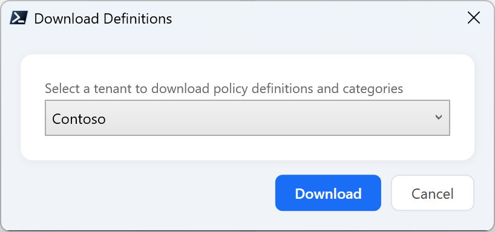
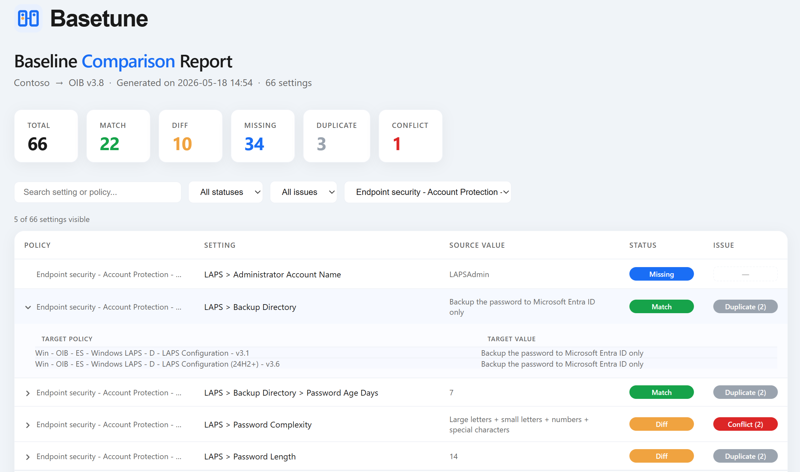
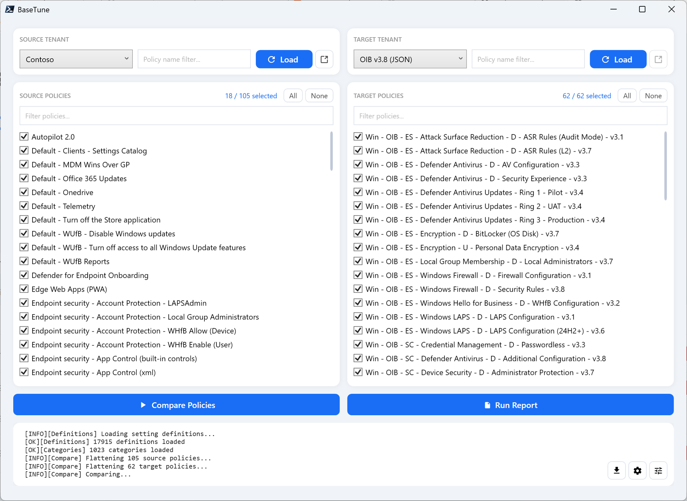
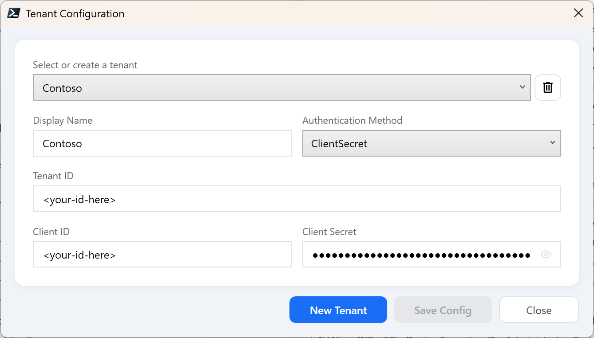
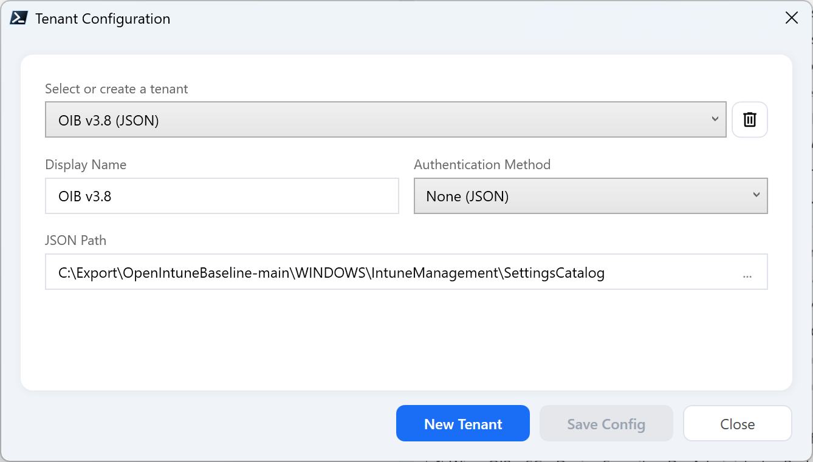
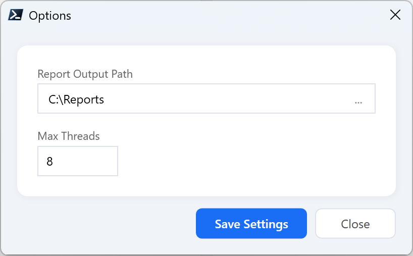
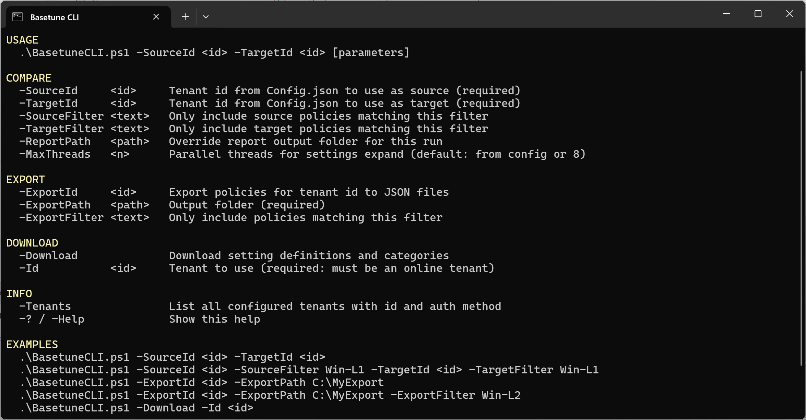

# Basetune

> Compare Intune policies across tenants and baselines — securely, offline-capable, and fully under your control


---

## Requirements

- PowerShell 7+
- A Microsoft Entra App Registration with the **DeviceManagementConfiguration.Read.All** Application permission for Microsoft Graph API.
- A directory of exported policy files in JSON format. Each file is expected to contain the following fields: id, name, and a settings array.

<br>

> **Important:** Please ensure that an administrator grants tenant-wide admin consent for this permission.

---

## Quick Start

1. Download the latest `Basetune.zip` from the [Releases](https://github.com/roweski/basetune/releases/latest) page and extract it to a folder of your choice.
2. Open the UI and go to the gear icon → **Tenant Configuration**, or edit `Config\Config.json` directly to add a tenant or offline baseline. A reference template is available in `Config\Config.example.json`.
3. Add at least one online tenant using your App Registration credentials and download setting definitions to enable friendly display names during comparisons.
Click the blue download icon in the UI status bar and select the online tenant from the list, or use the CLI:
```powershell
   .\BasetuneCLI.ps1 -Tenants # find your tenant's Id        
   .\BasetuneCLI.ps1 -Download -Id <tenant id>
```
4. Select a source and target tenant in the main UI and click **Load** to import policies.
5. Select at least one source and target policy and click **Compare Policies** to run the comparison and generate the report, or use the CLI:
```powershell
   .\BasetuneCLI.ps1 -SourceId <tenant id> -TargetId <tenant id>
```

---

## What it does

Basetune is a PowerShell-based tool to compare **Intune Settings Catalog** and **Security Baseline** policies across tenants or exported baselines.  Policies can be loaded online through the Microsoft Graph API or offline from exported JSON files — whichever fits your workflow.

Comparison capabilities:
- **Source vs. Target** — Each run compares one source against one target. Source and target can be any combination of online tenants and offline baselines.
- **Unlimited tenant configuration** — Configure as many tenants and baselines as you need, then pick which two to compare at runtime (from the UI or via CLI parameters).
---

## Why Basetune?

**Secure by design**
- Use your own App Registration (no third-party multi-tenant applications)
- **Client secrets are encrypted** using Windows DPAPI (CurrentUser scope) and are never stored in plaintext
- All access is read-only and fully controlled through your own tenant configuration
- No external data processing

**Flexible tenant configuration**
- Configure an unlimited number of tenants and baselines
- Mix online and offline sources during comparisons

**Performance-focused**
- Minimal Microsoft Graph API calls after the initial load
- Compare baselines offline using exported JSON policies without an internet connection
- Local caching of policies, settings, and definitions
- Built-in retry logic and error handling

---

## Setup

**1. Download the latest release**

Go to the [Releases](https://github.com/roweski/basetune/releases/latest) page and download the latest `Basetune.zip`. Extract it to a folder of your choice. 

<br>

**2. Configure your tenants**

Basetune uses a **multi-tenant config** — you define any number of named tenant entries and pick source and target at runtime, either from the UI or via CLI parameters. Each comparison run uses exactly one source and one target.

Tenants are configured through the UI (gear icon → Tenant Configuration) or by editing `Config\Config.json` directly.

> Plaintext `clientSecret` values in `Config.json` are **automatically migrated to encrypted form on first load**. After migration, the on-disk value is replaced with a `DPAPI:`-prefixed blob.


Each tenant entry requires:

| Field | Description |
|---|---|
| `displayName` | Friendly name shown in dropdowns |
| `authMethod` | `ClientSecret`, `Certificate`, or `None` (offline JSON only) |
| `tenantId` | Entra tenant ID |
| `clientId` | App registration client ID |
| `clientSecret` | Client secret (when authMethod = ClientSecret). Stored encrypted with DPAPI |
| `certThumbprint` | Certificate thumbprint (when authMethod = Certificate) |
| `path` | Local folder for JSON files (when authMethod = None) |
 
<br>

**3. Download setting definitions**

Before running your first comparison, download the setting definitions and categories. Basetune uses these to resolve friendly display names in the reports; without them, the reports will display raw setting definition IDs.

> Both `settingDefinitions.json` and `settingCategories.json` are saved to `.\Definitions` and reused for all subsequent comparisons. 

Run the CLI with `-Download -Id <tenant id>`. The Id represents the unique key in Config.json.

```powershell
# List current tenant configuration for id lookup
.\BasetuneCLI.ps1 -Tenants

# Download definitions using the specified online tenant
.\BasetuneCLI.ps1 -Download -Id 1
```

Run the UI. When setting definitions are not yet available, the Download icon in the status bar is highlighted in blue — click it to start.

<a href="docs/controls.png" target="_blank">
  
</a>

Select a tenant from the list, or create a new one in tenant configuration using an app registration.

<a href="docs/definitions.png" target="_blank">
  
</a>

Once the download completes, the icon returns to its neutral state — definitions are cached and ready to use.

<a href="docs/controls2.png" target="_blank">
  
</a>

---

## Under the Hood: JSON and Graph API Structure

If you export a Settings Catalog policy using the Microsoft Graph API (via the `configurationPolicies` endpoint), you will notice that settings are represented as structured objects within a `settings` array. Each item in this array contains a `settingInstance` object that describes the actual setting.

Basetune first retrieves all policies using a lightweight list call that selects only the metadata fields it needs (like id and name). If a **filter** is configured, only policies whose name matches the filter are passed to the next step. Basetune then **expands** the settings for each remaining policy individually — in parallel, with a configurable thread limit. This parallel approach significantly reduces total loading time when a tenant contains a large number of policies.

> **Note:** The `settings` array is not returned by default. Basetune explicitly requests it by appending `$expand=settings` to the API call when loading policies.

Once the policies and their settings are successfully retrieved, Basetune caches this data locally to prevent redundant API calls when comparing the selected policies.

The `settingDefinitionId` is a technical identifier that corresponds to a human-readable friendly name shown in the Intune UI. Instead of fetching the values per policy using `$expand=settingDefinitions`, Basetune downloads all setting definitions in a single call to a JSON file. These are reused for all subsequent comparisons to minimize API overhead and enable **offline** comparisons without requiring an active connection.

Settings Catalog policies use several different `@odata.type` values to represent different kinds of settings. Basetune handles all of them during the flattening step. Each `settingInstance` is recursively walked and flattened into a canonical `SettingObject` with a `DefinitionId`, `RawValue`, and optional `ParentDefinitionId`. Once both source and target policies are flattened, Basetune compares them by `DefinitionId`. Each setting is assigned one of four statuses. 

Finally, raw values and definition IDs are resolved to friendly display names using the locally cached definitions before the report is generated.

---

## How comparison works

1. Policies are loaded for both sides and settings are expanded (online via Graph API or offline from JSON files)
2. Each policy's `settings` array is flattened into individual `settingInstance` objects
3. Settings are matched by `settingDefinitionId` across source and target
4. Each pair is classified as **Match**, **Diff**, **Missing**, or **Extra**
5. If `settingDefinitions.json` and `settingCategories.json` are present in `.\Definitions`, IDs are resolved to friendly display names
6. Results are written to HTML and CSV

> If at least one side is an online tenant, missing categories are resolved automatically via Graph API and added to `settingCategories.json`. If both sides are offline baselines and a category cannot be resolved, it will appear as **`[Unresolved Category]`** in the report.

---

## Output

For every setting, the report identifies:

- **Match** — the setting is present in the target with the same value
- **Diff** — the setting is present but the value differs
- **Missing** — the setting is not present in the target at all
- **Extra** — the setting is present in the target but not in the source (`diff.csv` only)

On top of that, it detects cross-policy issues within the target tenant:

- **Duplicate** — the setting appears in multiple target policies with the same value
- **Conflict** — the setting appears in multiple target policies with different values

<br>

| File | Description |
|---|---|
| `diff.csv` | Full detail — one row per source setting × target policy match |
| `report.html` | Visual overview — one row per unique setting with aggregated status |
| `summary.csv` | Per baseline policy: Total / Match / Missing / Diff counts + Compliance % |
| `overlap.csv` | Only Duplicate and Conflict settings, with all involved target policies and values |

<br>

The HTML report (`report.html`) lets you drill down per setting — expand any row to see exactly which target policies contain that setting and what value each one has. The report header shows the source and target tenant names.

<br>



<br>

---

## UI

Basetune includes a WPF-based UI for configuring and running comparisons without using the command line.



### Running the UI

**Via CMD launcher**

```powershell
.\Start-BasetuneUI_PS7.cmd
```

**Via PowerShell 7**

```powershell
.\BasetuneUI.ps1
```

### Tenant Configuration

Manage all tenants via Tenant Configuration.

Online tenant using an App Registration:

<a href="docs/tenant.png" target="_blank">
  
</a>

Offline baseline using exported JSON policies:

<a href="docs/json.png" target="_blank">
  
</a>


### Report folder and performance options

Configure the default report folder and set the number of parallel threads used for Graph API requests. Higher values will result in faster policy evaluation when expanding settings, but may increase the risk of API throttling

<a href="docs/options.png" target="_blank">
  
</a>

---

## CLI

Basetune includes a command-line interface for running comparisons and exports from a terminal or automation script.



### Running the CLI

**Via CMD launcher**

```powershell
.\Start-BasetuneCLI_PS7.cmd
```

**Via PowerShell 7**

```powershell
.\BasetuneCLI.ps1
```

---

## Authentication

Basetune uses a **stateless authentication model**. A a result, tokens are retrieved **on demand** and stored **in memory only**. 

Authentication methods supported are `Client Secret` or `Certificate`. Both use the **OAuth 2.0 client credentials flow**.

Certificate-based tenants don't store any secret in `Config.json` — only the certificate thumbprint. The private key lives in the Windows Certificate Store (`CurrentUser\My` or `LocalMachine\My`) and is used to sign a JWT assertion (RS256) on each token request. The same `CurrentUser` vs `LocalMachine` trade-off applies to where you import the certificate.

---

## Secret storage

Client secrets for `ClientSecret` tenants are stored in `Config\Config.json` in **encrypted form** using the **Windows Data Protection API (DPAPI)**. Plaintext secrets never touch disk after the first save.

### How it works

- **Encryption scope:** `CurrentUser` — the secret can only be decrypted by the **same Windows user** on the **same machine** that encrypted it. Other users on the same box (including local admins) cannot decrypt it.
- **Storage format:** encrypted values in `Config.json` are prefixed with `DPAPI:` followed by a hex-encoded blob. Anything without that prefix is treated as plaintext.
- **Automatic migration:** if you place a plaintext secret in `Config.json`, Basetune detects it on first load, encrypts it with DPAPI, and rewrites `Config.json` in place. The plaintext value is replaced — no manual step needed.
- **In memory:** decrypted secrets exist briefly in memory only for the duration of the OAuth 2.0 token request, then drop out of scope. Tokens themselves are never persisted.

### Why CurrentUser scope (and not LocalMachine)

`LocalMachine` scope would let any user on the same box (service accounts, admin RDP sessions, scheduled tasks running as SYSTEM) decrypt the secrets — effectively worse than keeping them in your own user profile. `CurrentUser` is the same scope used by the Microsoft Graph PowerShell SDK, AzureAD module, and `Connect-AzAccount` for cached token storage, and is the standard choice for Windows-local credential protection.

### Scheduled tasks and service accounts

Because DPAPI binds the encrypted secret to the **Windows user profile that encrypted it**, running the CLI under a different account — for example via Task Scheduler under a service account — requires a one-time setup step in that account's context.

---

## Offline JSON compatibility

Offline mode accepts Intune Settings Catalog and Security Baseline JSON files exported by any of the following tools:

| Source | How to export |
|---|---|
| **Basetune CLI** | Use `-ExportId <tenant id>` |
| **Basetune UI** | Click the export button. |
| **Intune portal** | Devices → Configuration → select policy → Export JSON |
| **[Open Intune Baseline](https://github.com/SkipToTheEndpoint/OpenIntuneBaseline)** | Download JSON files from GitHub |
| **[Micke-K IntuneManagement](https://github.com/Micke-K/IntuneManagement)** | Export Settings Catalog policies via the built-in export |

> Any JSON that contains `id`, `name`, and a `settings` array will work with Basetune.

---

## Comparison edge cases

Below are a number of non-trivial cases that the tool handles correctly.

### Implicit parent levels in the breadcrumb path

The setting path in the `Setting` column may contain parent levels that are **not** defined as categories in the categories JSON file. The tool reconstructs the full hierarchy, this means the path reflects the **logical** hierarchy as shown in the UI, not just the category tree from the JSON.

For example, `Choose how BitLocker-protected operating system drives can be recovered` is not a category in the JSON. Yet it appears as a parent segment in the path of its sub-setting.

### Nested sub-settings

Some settings contain additional configuration options that only become available when the parent setting is set to **Enabled**. Basetune combines these into a single readable output value: `Enabled: SelectedValue`

**Source setting:**

- *Choose how BitLocker-protected operating system drives can be recovered* → `Enabled`
  - Dropdown → `Do not allow 256-bit recovery key`

**Report output:**

| Setting | Source value |
|---|---|
| Administrative Templates > Windows Components > BitLocker Drive Encryption > Operating System Drives > Choose how BitLocker-protected operating system drives can be recovered | Enabled: Do not allow 256-bit recovery |

### List values (variable length)

Policies that contain a list of values (such as file extensions, keywords, or paths) are serialized as a single string with `|` as the separator. The parent toggle and the list are shown as separate rows.

**Source setting:**

- *Exclude specific kinds of files from being uploaded* → `Enabled`
  - Keywords: `*.accdb`, `*.appx`, `*.bat`, `*.cmd`, `*.exe`, `*.img`, `*.iso`, `*.jar`, `*.lnk`, `*.mdb`, `*.msi`, `*.pst`, `*.reg`, `*.vbs`, `*.vhd`, `*.vhdx`, `*.vmdk`

**Report output:**

| Setting | Source value |
|---|---|
| OneDrive > Exclude specific kinds of files from being uploaded | Enabled |
| OneDrive > Exclude specific kinds of files from being uploaded > Keywords: (Device) | *.accdb \| *.appx \| *.bat \| *.cmd \| *.exe \| *.img \| *.iso \| *.jar \| *.lnk \| *.mdb \| *.msi \| *.pst \| *.reg \| *.vbs \| *.vhd \| *.vhdx \| *.vmdk |

---

## Error Handling, Throttling & Retries

The module features a robust, built-in error handling mechanism to ensure resilience during bulk operations and high-concurrency workloads.

### Resilience Framework
When making Graph API requests, the module automatically categorizes and reacts to different response behaviors:

| Issue / HTTP Status | Scenario | Module Behavior & Action |
| :--- | :--- | :--- |
| **API Throttling**<br>`HTTP 429` / `503` | Graph rate limits exceeded. | Reads the `Retry-After` header (defaults to 10s if absent). Backs off and retries up to **5 times** before failing. |
| **Server Errors**<br>`HTTP 500` / `502` / `504` | Transient gateway or server faults. | Automatically retries up to **3 times** using **exponential back-off** (2s, 4s, 8s...). |
| **Intune Proxy Errors**<br>`HTTP 200` with Error Body | Graph returns success but payload contains an error object (e.g., `UnknownError`). | Treated as a transient API error; retries up to **3 times** with exponential back-off. |
| **Expired Token**<br>`HTTP 401` | Access token has expired mid-flight. | Automatically requests a fresh access token and retries the request exactly **once**. |
| **Fatal Errors**<br>All other codes | Bad requests, permissions issues, etc. | Immediately aborts the request and throws an actionable exception to prevent infinite loops. |

### Performance Optimization Tip
When configuring **Parallel Threads** for settings expansion or policy evaluations, keep this behavior in mind:
* **Higher thread counts** will speed up the process initially.
* However, excessive parallel requests increase the likelihood of triggering **HTTP 429 (Throttling)**.
* While the module gracefully handles this by pausing and retrying, heavy throttling will ultimately reduce overall performance and introduce execution delays. Find a balanced thread count that optimizes speed without constantly hitting rate limits.

---

## License

MIT — free to use, modify and distribute.

---

*Built for the Intune community.*
